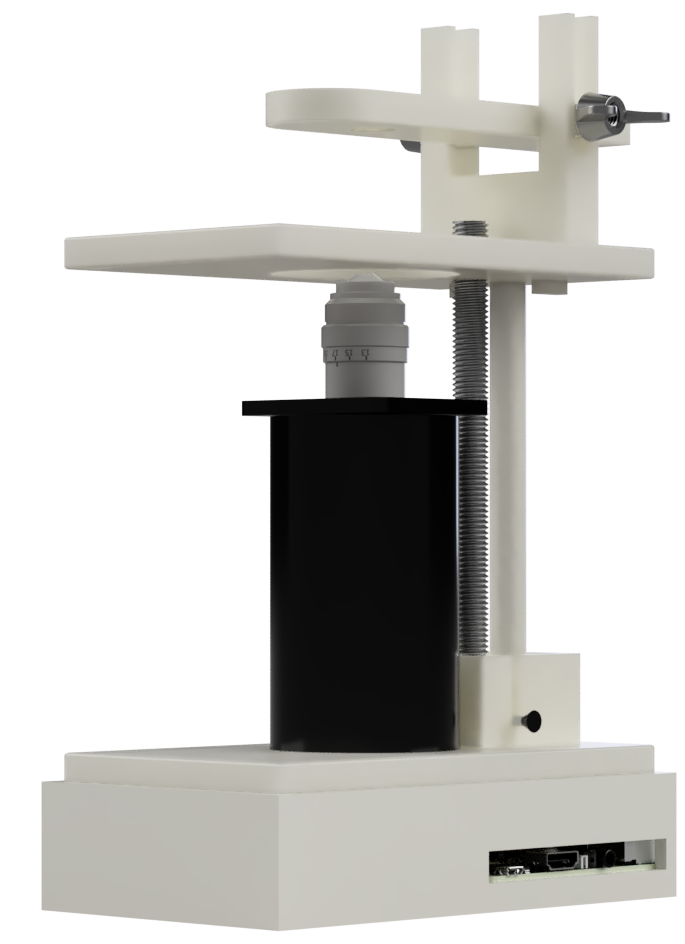
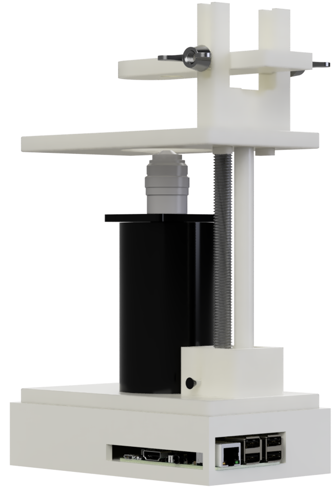
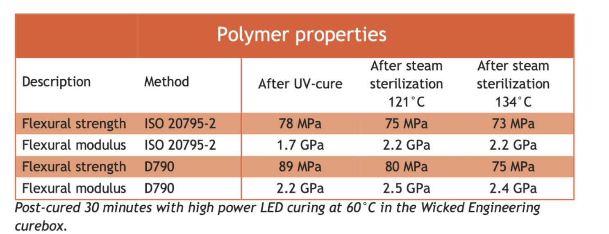

# **OptiClave**
At OptiClave we aim to provide to tackle the problem to microscopy within tissue hoods by providing a simple to assemble, open-source and autoclavable microscope that can accurately image inside a tissue hood.  


## Printing
The STL files for OptiClave can be found in this repository.  

We recommend the use of SLA printing with a specific type of autoclavable resin, explained further below.  

Using other types of 3D printing or materials may cause damage during autoclaving.  


<p align="center">
  
  
</p>
  


## Materials

To print the microscope, a biocompatible, autoclavable resin (such as LiqCreate Biocompatible Resin) is recommended. Liqcreate maintains high flexural strength and modulus even after autoclaving at 121°C and 134°C, making it the best candidate for sterilisable 3D-printed tissue culture components. Although slightly more expensive, the cost per print is not significantly higher, making it an optimal choice in terms of both performance and affordability.


[https://www.liqcreate.com/biocompatible-dlp-lcd-sla-3dprinting-resin/]


## Assembly

An assembly video is provided within this repository:  

The Raspberry Pi is placed into the electronics box, aligning the ports with the gaps as seen in the video and the lid is placed on top.  

The threaded rod is to have its gear screwed onto the bottom and placed into the gear box alongside the stable rod.  

The specimen platform can be pushed onto the stop of the rods, acting as a cantilever while the LED holder is assembled on top.  

Finally, the objective is screwed into the optics tube and attached using the twist and lock mechanism using the protusions at its base.  

A video render of the assembly can be seen below.  

[Assembly Video](Assembly.avi)

## Wiring
The wiring for OptiClave is fairly simple:  

Connect pin 11 and the ground to the white LED in the cantilever.  


[SparkFun Pi GPIO Guide](https://learn.sparkfun.com/tutorials/raspberry-gpio/gpio-pinout)  

  

The Pi camera should be attatched via ribbon to the Pi board and slotted through the hole in the botton of the microscope to be clipped into the optics tube.  

Ensure all wires are kept outside of the cameras field of view and are removed before autoclaving.  

Electronics should be steralised using less aggressive techniques, ideally isopropyl alcohol.  


## Programming
OptiClave comes with prewritten Python to work

Install the correct dependencies:
#### PiCamera2 (for camera control)
```
sudo apt update
sudo apt install python3-picamera2
```

#### OpenCV (image processing/display)

```
sudo apt install python3-opencv
```

#### RPi.GPIO (for GPIO control)

```
sudo apt install python3-rpi.gpio
```

### Running the script
Save the script into the pi using

```
git add https://github.com/tanvik7072/OptiClave
```

Make it executable:

```
chmod +x PiCamera.py
```

Run it:

```
python3 PiCamera.py
```

## Usage

Once setup and the Python script is running, a window should appear showing the view of the camera. Place a sample above the cameraon the platform and use this to adjust the focus of the microscope until a clear image can be seen.  

Within the console:  
Press S to take a screenshot  
Press Q to quit


