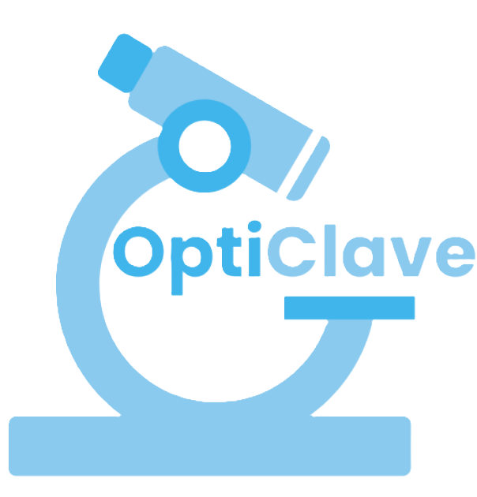

# **OptiClave**
At OptiClave we aim to provide to tackle the problem to microscopy within tissue hoods by providing a simple to assemble, open-source and autoclavable microscope that can accurately image inside a tissue hood.



## Printing
The STL files for OptiClave can be found in this repository.
We recommend the use of SLA printing with a specific type of autoclavble resin
Using other types of 3D printing or materials may cause damage during autoclaving


## Materials

## Wiring
The wiring for OptiClave is fairly simple:
Connect pin 11 and the ground to the white LED in the cantilever.


[SparkFun Pi GPIO Guide](https://learn.sparkfun.com/tutorials/raspberry-gpio/gpio-pinout)

The Pi camera should be attatched via ribbon to the Pi board and slotted through the hole in the botton of the microscope to be clipped into the optics tube.
Ensure all wires are kept outside of the cameras field of view and are removed before autoclaving.
Electronics should be steralised using less aggressive techniques, ideally isopropyl alcohol

## Programming
OptiClave comes with prewritten Python to work

Install the correct dependencies:
#### PiCamera2 (for camera control)
```
sudo apt update
sudo apt install python3-picamera2
```

#### OpenCV (image processing/display)

```
sudo apt install python3-opencv
```

#### RPi.GPIO (for GPIO control)

```
sudo apt install python3-rpi.gpio
```

### Running the script
Save the script into the pi using

```
git add https://github.com/tanvik7072/OptiClave
```

Make it executable:

```
chmod +x PiCamera.py
```

Run it:

```
python3 PiCamera.py
```


